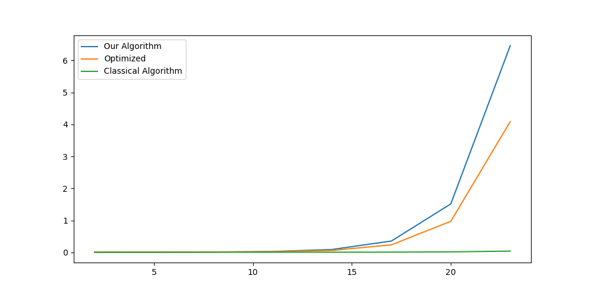

# Linear Reduction
*Ari Feiglin and Noam Kaplinski under the guidance of Dr. Yoni Zohar*

## Introduction

This project implements a method we devised for interpreting and executing code, as well as comparing this new
method with an existing algorithm.
We intend to show that our algorithm works, by providing both a formal proof of a fragment of it as well as
running example programs using it.

We use our algorithm to implement an interpreter for a toy language in OCaml, and we provide an alternative
method for interpreting this language: a fully functional interpreter implemented in OCaml using [Menhir](https://gallium.inria.fr/~fpottier/menhir/).

## Theoretical Documentation

We provide documentation on how our algorithm works in `Paper/paper.pdf` (an older version can be found in `Docs/linear-reduction.pdf`).
This includes a formal proof that (a fragment of) our algorithm works, as well as details about the construction
of our toy language (L-Lang).

To compile `Paper/paper.pdf` navigate to the `Paper/` directory and then run the following commands:
```sh
pdflatex paper
biber paper
pdflatex paper
pdflatex paper
```

## Downloading and Building

### Downloading the Source

Ensure you have git installed and run (in the desired directory)
```sh
git clone https://github.com/ari-feiglin/linear-reduction
```
This should clone all the source into a directory called `linear-reduction`.
Now `cd` into this directory:
```sh
cd linear-reduction
```
All subsequent commands are done relative to this directory.

Now you can use Docker to run the programs in a container, or you can compile both implementations (ours and the classical) yourself and run them locally.

### Running With Docker

Build the Docker image:
```sh
docker build -t linear-reduction .
```
And run it in a container:
```sh
docker run --name lr-container -it linear-reduction:latest
```
You can then navigate around the container and run the programs.
The binaries (`llang` and `llang-classical`) are already compiled for you, so you can skip the next two sections to the section on running.
If you wish to exit the interactive shell, just run `exit`.
To rerun, you must remove the container lr-container with
```sh
docker container rm lr-container
```
and run again.

If you do use docker, please read the section on [viewing the results](#viewing-the-results).

### Linear Reduction Implementation

Navigate to the source for the implementation of linear reduction:
```sh
cd Source
```
Set up the opam environment
```sh
eval $(opam env)
```
Run make
```sh
make
```
This will compile the source into an executable `llang` under the `linear-reduction` directory.
Note that a `make clean` command is provided as well.

### Classical Implementation

Navigate to the source for the classical implementation:
```sh
cd Classical-Source
```
Run make
```sh
make
```
This will compile the source into an executable `llang-classical` under the `linear-reduction` directory.
Note that a `make clean` command is provided as well.

## Running

Demo files are provided in the `Demos/` directory.

**Note:** the menhir-based interpreter does not support all of the files in this directory.
It only supports the following: `arithmetic.ml`, `currying.ml`, `fib-rec.ml`.

### Linear Reduction Implementation

To run our implementation of our algorithm, simply run `./llang <file path> [y]`.
This will execute the file specified by the path `<file path>`.
Debugging information is printed unless `[y]` is specified.

### Classical Implementation

To run our implementation of the classical algorithm, simply run `./llang-classical <file path>`.
This will execute the file specified by the path `<file path>`.

## Comparisons

Python scripts for comparing runtimes of our and the classical algorithms are provided in the `Comparisons/` directory.
Commands in this section are relative to the `Comparisons/` directory.

### Finding the Mean Runtime

To find the mean runtime of each algorithm on a set program specified by `<file path>`, run
```sh
python3 comparer.py <file path>
```
This will run the program 300 times with each interpreter, and present the results.
It will print the mean runtimes (in seconds) as well as creating a bar graph representing the total time each interpreter ran.

For example,
```sh
python3 comparer.py ../Demos/currying.ml
```
will produce


Our algorithm takes on average 0.0040886 seconds to execute, while the classical algorithm takes 0.00369256 seconds.

### Fibonacci

Another demo program provided is `Demos/fibonacci.ml`, which uses the standard recursive formula to compute `fibonacci(n)` (`n` is hard-coded in the file).
We can graph the time it takes each algorithm to compute `fibonacci(n)` as a function of `n`, by using the `fib-compare.py` program.
Simply run
```sh
python3 fib-compare.py
```
and it will produce a graph of the runtimes.

Using exponential regression, we can estimate that the runtime for both algorithms are $`a\cdot b^n`$ where
```math
\text{Our Algorithm: } a=0.000138585, b=1.64685, \qquad \text{Classical Algorithm: } a=0.00000362553, b=1.5809
```

### Arithmetical Expressions

We provide a script `Demos/create-expression.py` to create complex arithmetical expressions.
We can then time the time it takes for each interpreter to parse and compute the expression.
Each expression is parameterized by a length and depth, where the length is the number of parenthesized subexpressions in the expression, and depth is the depth of parentheses.
To create an expression with a specified length and depth, run
```sh
python3 create-expression.py <length> <depth>
```
And this will put the expression in a file called `expression.txt`.

We also provide a script in `Comparisons/expr-compare.py` to compare the runtimes of each interpreter.
Simply run
```sh
python3 expr-compare.py
```
and it will produce a plot of the times:


## Viewing The Results

### With Docker

Docker does not seem to support use of interactive matplotlib plots, so all plots are saved to pngs in the docker container.
After you run a comparer program, (one of `comparer.py`, `expr-compare.py`, `fib-compare.py`) a png will be created.
The name of this png is printed (respectively, `comparer.png`, `expr.png`, `fib.png`).
In another shell (or once you exit the interactive shell), you can run the command
```sh
docker cp lr-container:/app/Comparisons/<FILE NAME> <DESTINATION>
```
where `<FILE NAME>` is one of `comparer.py`, `expr-compare.py`, `fib-compare.py`, and `<DESTINATION>` is where you want the file to be copied to on your local host.
You can then view this image file with any tool of your choosing (e.g. `wslview`, `xdg-open`, etc.).

### Normally

The images of the python comparison programs are written to .png files in the `Comparisons/` directory.
Simply view them with any tool of your choice (e.g. `wslview`, `xdg-open`, etc.).

## Conclusions

As we can see, in each of the benchmark tests, the classical algorithm is quicker than ours.
This is not surprising; the classical algorithm is, after all, a classic.
It has gone through many years of research and is widely used for a reason.
Furthermore, the tool we used for parsing, Menhir, has minor optimizations to make parsing quicker.
This is not to say that Menhir is always quicker; there may exist a class of programs which are parsed quicker by our algorithm.
Furthermore, with time we believe that optimizations may be found for our algorithm to make it at least competitive with the classical algorithms.

## Notes

The interpreter in `Classical-Source/` (`llang-classical`) does not support all the functionalities the one in `Source/` (`llang`) does.
It does not support lists, products, or types.

### Function Applications

`llang-classical` does not support repeated function applications like `f a b` (i.e. in the case `f a` returns a function).
This is because the grammar that `llang-classical` uses the following fragment:
```
value -> const | id | funcall
funcall -> value value
```
This means that the value `f a b` can be parsed as
```
        value
          |
       funcall
      /       \
    value    value
      |        |
     id     funcall
      |    /       \
      f  value    value
           |        |
          id       id
           |        |
           a        b
```
And so it is in interpreted as `f (a b)` instead of `(f a) b`.
As far as we are aware, this is unavoidable.
As such, the demos in `Demos/` are all written in a `llang-classical`-friendly manner.
But our algorithm handles this case with ease.

